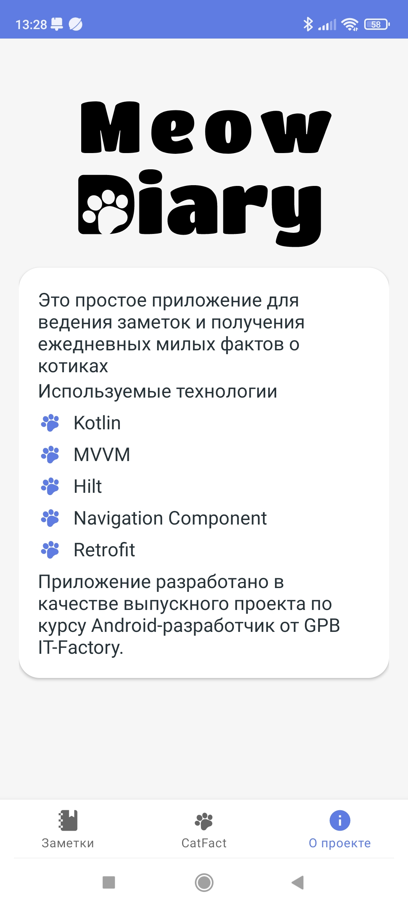

# MeowDiary

### Функции
---
- Создание/редактирование/удаление заметки
- Поиск по заметкам
- Просмотр факта о котике

### Используемые технологии
---
- Архитектура: MVVM
- Язык программирования: Kotlin
- Сторонние библиотеки: Hilt, Navigation Component, Retrofit, Room, Gson

### Экраны
<table srtyle="width:100%">
  <tr>
    <th>SplashScreen</th>
    <th>HomeScreen</th>
  </tr>
  <tr>
    <td></td>
    <td></td>
  </tr>
  <tr>
    <th>NoteScreen</th>
    <th>CatFactScreen</th>
  </tr>
  <tr>
    <td></td>
    <td></td>
  </tr>
  <tr>
    <th>InfoSrceen</th>
  </tr>
  <tr>
    <td></td>
  </tr>
</table>
